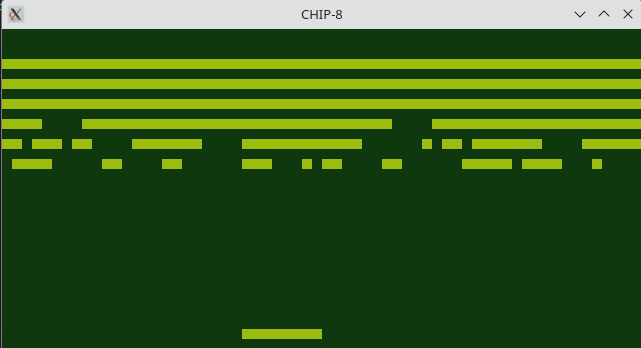

# CHIP-8 Emulator

A modern C++ implementation of a CHIP-8 virtual machine with OpenGL rendering and Game Boy-inspired colors.



## Features

- Complete CHIP-8 instruction set implementation
- Game Boy-inspired color scheme (dark/light green)
- OpenGL rendering with pixel scaling
- Modern Keyboard input mapping
- Sound support
- Cross-platform compatibility

## Technical Details

The emulator implements the standard CHIP-8 architecture:

- 4KB (4096 bytes) of memory
- 16 8-bit registers (V0-VF)
- 16-bit index register (I)
- 16-bit program counter (PC)
- 16-level stack for subroutine calls
- 8-bit delay and sound timers
- 64x32 monochrome display
- 16-key hexadecimal keypad
- 35 opcodes for application logic

## Dependencies

- **GLFW3**: Window creation and OpenGL context management
- **OpenGL**: Graphics rendering
- **mpg123**: Audio playback for the sound timer

## Installation

### Linux

1. Install dependencies:
   ```bash
   # Ubuntu/Debian
   sudo apt-get install libglfw3-dev mpg123
   
   # Fedora
   sudo dnf install glfw-devel mpg123
   
   # Arch
   sudo pacman -S glfw-x11 mpg123
   ```

2. Clone the repository:
   ```bash
   git clone https://github.com/yourusername/CHIP-8-Emulator.git
   cd CHIP-8-Emulator
   ```

3. Build the emulator:
   ```bash
   make
   ```

### Windows

1. Install dependencies using MSYS2 or download prebuilt libraries:
   - GLFW3: [Download](https://www.glfw.org/download.html)
   - mpg123: [Download](https://www.mpg123.de/download.shtml)

2. Clone the repository and build with MinGW:
   ```bash
   git clone https://github.com/yourusername/CHIP-8-Emulator.git
   cd CHIP-8-Emulator
   make
   ```

## Usage

Run the emulator with a ROM file:

```bash
./chip8 path/to/rom.ch8
```

Or use the included script:

```bash
./run.sh rom.ch8
```

## Keyboard Controls

The CHIP-8 uses a 16-key hexadecimal keypad. This emulator maps it to a standard keyboard as follows:

```
CHIP-8 Keyboard    PC Keyboard
---------------    -----------
1 2 3 C            1 2 3 4
4 5 6 D            Q W E R
7 8 9 E            A S D F
A 0 B F            Z X C V
```

Press `ESC` to exit the emulator.

## Project Structure

```
.
├── include/            # Header files
│   ├── cpu.h           # CPU/memory implementation
│   └── glad.h          # OpenGL loader
├── src/                # Source files
│   ├── cpu.cpp         # CPU instruction set implementation
│   ├── display.cpp     # Main program and rendering
│   └── glad.c          # OpenGL function loading
├── programs/           # CHIP-8 ROMs
├── Makefile            # Build configuration
├── run.sh              # Helper script
└── README.md           # This file
```

## Implementation Details

### CPU Emulation

The CPU class emulates all standard CHIP-8 instructions, including:

- Memory operations
- Register manipulation
- Conditional branching
- Graphics rendering
- Timers and sound
- Keyboard input

### Display Rendering

The display uses OpenGL for rendering, scaling the CHIP-8's 64x32 resolution to a larger window size while maintaining pixel-perfect rendering. A Game Boy-inspired color scheme is used for visual aesthetics.

### Sound System

When the sound timer is non-zero, the emulator plays a sound using mpg123. The sound plays concurrently with the code to ensure gameplay continues smoothly.

## Resources

- [CHIP-8 Technical Reference](http://devernay.free.fr/hacks/chip8/C8TECH10.HTM)
- [How to write a CHIP-8 emulator](https://tobiasvl.github.io/blog/write-a-chip-8-emulator/)
- [Awesome CHIP-8](https://github.com/tobiasvl/awesome-chip-8) - Collection of CHIP-8 resources

- [CHIP-8 Tests](https://github.com/Timendus/chip8-test-suite?tab=readme-ov-file) - Helpful in Debugging
## License

This project is licensed under the MIT License - see the LICENSE file for details.

---

Created by [Tsekrekos Egor Andrianos] - [TsekrekosEA](https://github.com/TsekrekosEA)